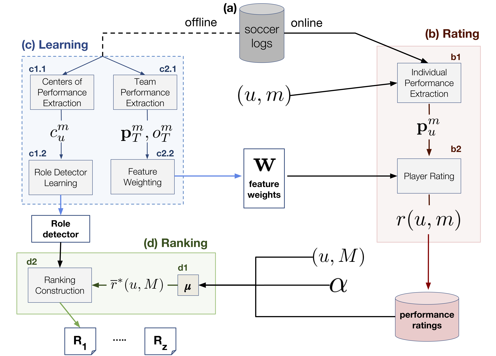

# PlayeRank

PlayeRank, a data-driven framework that offers a principled multi-dimensional and role-aware evaluation of the performance of soccer players. 

Playerank is designed to work with [soccer-logs](https://www.nature.com/articles/s41597-019-0247-7), in which a match consists of a sequence of events encoded as a tuple: `id`, `type`, `position`, `timestamp`,where `id` is the identifer of the player that originated/refers to this event, `type` is the event type (i.e., passes, shots, goals, tackles, etc.), `position` and `timestamp` denote the spatio-temporal coordinates of the event over the soccer field. PlayeRank assumes that soccer-logs are stored into a database, which is updated with new events after each soccer match.

As described by the figure below, the PlayeRank framework consists of four main components:
<ol type="a">
	<li>soccer-logs database</li>
	<li>learning module</li>
	<li>rating module</li>
	<li>ranking module</li>
</ol>


**Schema of the PlayeRank framework**. Starting from a database of soccer-logs **(a)**, it consists of three main phases. The learning phase **(c)** is an "online" procedure: It must be executed at least once before theother phases, since it generates information used in the other two phases, but then it can be updated separately. The rating **(b)** and the ranking phases **(d)** are online procedures, i.e., they are executed every time anew match is available in the database of soccer-logs. 

An exhaustive description of PlayeRank framework is available in this paper, if you use PlayeRank please cite it:

  Pappalardo, Luca, Cintia, Paolo, Ferragina, Paolo, Massucco, Emanuele, Pedreschi, Dino & Giannotti, Fosca (2019) PlayeRank: Data-driven Performance Evaluation and Player Ranking in Soccer via a Machine Learning Approach. ACM Transactions on Intelligent Systems and Technologies 10(5), DOI:https://doi.org/10.1145/3343172

Bibtex:
```
@article{10.1145/3343172,
author = {Pappalardo, Luca and Cintia, Paolo and Ferragina, Paolo and Massucco, Emanuele and Pedreschi, Dino and Giannotti, Fosca},
title = {PlayeRank: Data-Driven Performance Evaluation and Player Ranking in Soccer via a Machine Learning Approach},
year = {2019},
issue_date = {November 2019},
publisher = {Association for Computing Machinery},
address = {New York, NY, USA},
volume = {10},
number = {5},
issn = {2157-6904},
url = {https://doi.org/10.1145/3343172},
doi = {10.1145/3343172},
journal = {ACM Trans. Intell. Syst. Technol.},
month = sep,
articleno = {Article 59},
numpages = {27},
keywords = {data science, soccer analytics, clustering, searching, multi-dimensional analysis, football analytics, predictive modelling, ranking, big data, Sports analytics}
}
```

To build player rankings from soccer-logs data, the following steps are required:

1. compute feature weights (learning)
2. compute roles (learning)
3. compute performance scores (rating)
4. aggregate performance scores (ranking)

The code to reproduce the PlayRank framework is available as a Google Colab document here: 
http://bit.ly/playerank_Tutorial

It works on public soccer-logs data that are usable, upon citation, from this paper: 

  Pappalardo, L., Cintia, P., Rossi, A., Massucco, E., Ferragina, P., Pedreschi, D. & Giannotti, F. (2019) A public data set of spatio-temporal match events in soccer competitions. Nature Scientific Data 6(236),doi:10.1038/s41597-019-0247-7

Bibtex:
  ```
@article{10.1038/s41597-019-0247-7,
	Abstract = {Soccer analytics is attracting increasing interest in academia and industry, thanks to the availability of sensing technologies that provide high-fidelity data streams for every match. Unfortunately, these detailed data are owned by specialized companies and hence are rarely publicly available for scientific research. To fill this gap, this paper describes the largest open collection of soccer-logs ever released, containing all the spatio-temporal events (passes, shots, fouls, etc.) that occured during each match for an entire season of seven prominent soccer competitions. Each match event contains information about its position, time, outcome, player and characteristics. The nature of team sports like soccer, halfway between the abstraction of a game and the reality of complex social systems, combined with the unique size and composition of this dataset, provide an ideal ground for tackling a wide range of data science problems, including the measurement and evaluation of performance, both at individual and at collective level, and the determinants of success and failure.},
	Author = {Pappalardo, Luca and Cintia, Paolo and Rossi, Alessio and Massucco, Emanuele and Ferragina, Paolo and Pedreschi, Dino and Giannotti, Fosca},
	Da = {2019/10/28},
	Date-Added = {2019-12-29 16:44:01 +0000},
	Date-Modified = {2019-12-29 16:44:01 +0000},
	Doi = {10.1038/s41597-019-0247-7},
	Id = {Pappalardo2019},
	Isbn = {2052-4463},
	Journal = {Scientific Data},
	Number = {1},
	Pages = {236},
	Title = {A public data set of spatio-temporal match events in soccer competitions},
	Ty = {JOUR},
	Url = {https://doi.org/10.1038/s41597-019-0247-7},
	Volume = {6},
	Year = {2019},
	Bdsk-Url-1 = {https://doi.org/10.1038/s41597-019-0247-7},
	Bdsk-Url-2 = {http://dx.doi.org/10.1038/s41597-019-0247-7}}

  ```


